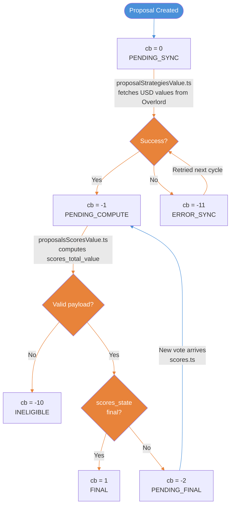
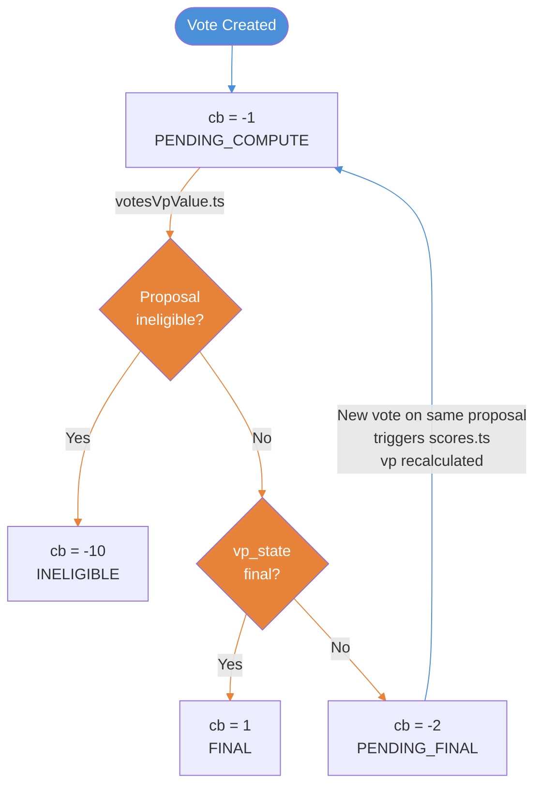

# Proposals & Votes CB Flow

## CB States

| Value | Constant | Proposals | Votes |
|------:|----------|-----------|-------|
| 0 | `PENDING_SYNC` | Default. Waiting for strategy values from Overlord | N/A |
| -1 | `PENDING_COMPUTE` | Strategy values synced. Waiting for `scores_total_value` computation | Default. Waiting for `vp_value` computation |
| -2 | `PENDING_FINAL` | Score value computed, but proposal still active | Value computed, but `vp_state` not final |
| 1 | `FINAL` | Fully computed | Fully computed |
| -10 | `INELIGIBLE` | Invalid payload format, cannot compute (permanent) | Invalid data, cannot compute (permanent) |
| -11 | `ERROR_SYNC` | Overlord sync failed, will be retried | N/A |

> 🟦 Blue = user action &nbsp;&nbsp; 🟧 Orange = async background script

## Proposals State Diagram

## Votes State Diagram

